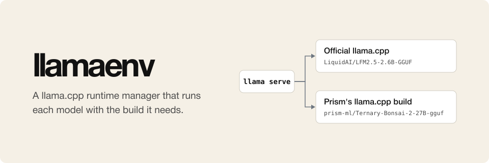

# llamaenv

<p align="center">
  
</p>

llamaenv is a runtime manager for llama.cpp that works next to the standard
[Llama app](https://github.com/ggml-org/Llama-Windows) and
[llama.app](https://llama.app) install. It runs each model with the llama.cpp
build that the model needs, and every other model with the official build.

With llamaenv, you download and select a model in the Llama app or the
llama.cpp web page as usual. A model that needs a custom build, such as Prism
ML's Bonsai 2 27B, runs on that build. Officially supported models keep running
on the official build. llamaenv switches between them when you select a model.

llamaenv can also pin or switch llama.cpp versions. For example, you can keep
one model on an older official version, or try a newer version as the default.

> **Work in progress.** llamaenv is a stopgap until llama.cpp can do this
> itself. When it can, remove llamaenv.

llamaenv leaves the standard install and the Llama app as they are. Models
without a mapping run exactly as without llamaenv. If llamaenv fails or is
removed, everything runs the standard way.

llamaenv runs on Windows, Linux, and macOS.

## Why

New models often come out before the inference engines support them. Until
the support is merged, each model needs its own special build, such as its
developer's fork or a nightly with a local patch. These are the models we ran
recently, with Bonsai on a Windows laptop and the rest on an NVIDIA DGX Spark:

- [Bonsai 2 27B](https://huggingface.co/prism-ml/Ternary-Bonsai-2-27B-gguf) by
  Prism ML needs [Prism's llama.cpp fork](https://github.com/PrismML-Eng/llama.cpp),
  because upstream llama.cpp cannot load its ternary weights.
- LongCat-Flash-Lite-Sparse needed a fork of SGLang installed over the official
  v0.5.16, because upstream support is still an
  [open pull request](https://github.com/sgl-project/sglang/pull/32918).
- [Ling-3.0-flash-VL-fp4](https://huggingface.co/inclusionAI/Ling-3.0-flash-VL-fp4)
  needed the publisher's SGLang development image and a vLLM nightly, because
  no stable release supported its image input yet.
- [Ling-3.0-flash-fp4](https://huggingface.co/inclusionAI/Ling-3.0-flash-fp4)
  needed another SGLang development image with its draft model, because the
  model card names that image.
- [Ling-3.0-tiny-fp8](https://huggingface.co/inclusionAI/Ling-3.0-tiny-fp8)
  needed a third development image, plus deterministic mode to work around a
  matrix-multiply defect on the DGX Spark's GB10 chip.
- [Qwen3.6-35B-A3B-NVFP4](https://huggingface.co/unsloth/Qwen3.6-35B-A3B-NVFP4)
  needed official vLLM 0.26.0 with a local patch that adds FlashInfer B12X
  kernels for the GB10.
- [Laguna-S-2.1-NVFP4](https://huggingface.co/poolside/Laguna-S-2.1-NVFP4) did
  not run on official vLLM 0.25.1 for arm64, because the memory guard stopped
  the trial.
- [Inkling-Small-NVFP4](https://huggingface.co/thinkingmachines/Inkling-Small-NVFP4)
  fails on the pinned official SGLang image, because of a shared-memory
  mismatch in its NVFP4 kernels.

This is a common need, and today every user solves it by hand. They install
the right build next to the standard one and switch between the two for each
model. Inference engines should standardize this. A model should be able to
say which build it needs, and the engine should run it with that build and
keep every other model on the standard one.

llamaenv does this for llama.cpp from the outside, until llama.cpp can do it
itself.

## Install

Download the archive for your system from the
[releases](https://github.com/osolmaz/llamaenv/releases), check it against
`SHA256SUMS`, and unpack `llamaenv`. Or build it with Go 1.26:

```sh
go build -o llamaenv .
```

`llamaenv install` puts a `llama` shim first on your user PATH, and installs
the official `llama` from llama.app when it is missing. It also restarts the
Llama app, so the app picks up the shim.

The Llama app for macOS does not use PATH, so on macOS `llamaenv install`
takes the place of the `llama` that the app runs, and `llamaenv uninstall`
puts it back.

## Set up a model

Add the build that the model needs, map the model to it, and optionally add a
llama.cpp preset with settings for the model:

```sh
llamaenv runtime add prism <folder with llama-server | archive URLs...>
llamaenv map prism-ml/Ternary-Bonsai-2-27B-gguf prism
llamaenv preset add prism bonsai-2-27b.ini
llamaenv install
```

A preset is a plain llama.cpp preset, the same file that
`llama serve --models-preset` reads:

```ini
[prism-ml/Ternary-Bonsai-2-27B-gguf:PQ2_0]
hf-repo = prism-ml/Ternary-Bonsai-2-27B-gguf:PQ2_0
ctx-size = 98304
parallel = 1
```

Only that build's router gets it. Each model gets its own preset file, so
setting up another model on the same build keeps this one. A context size that
you set in the Llama app still wins over the preset.

[`examples/bonsai`](examples/bonsai) has complete setup scripts for Windows and
Linux, and a preset for Bonsai 2 27B.

After setup, download the model in the Llama app, or run `llama serve` as
usual.

## Everyday commands

```sh
llamaenv list        # which model uses which runtime and preset
llamaenv status      # the running switchers, their routers, and requests in flight
llamaenv logs        # the log folders and the end of each log
llamaenv versions    # official llama and runtime versions
llamaenv use <name>  # a different default runtime; "official" goes back
llamaenv unmap <model>
llamaenv uninstall   # back to the plain standard setup
```

Downloaded model files stay in the Hugging Face cache when you uninstall.

## Diagnostics

Each switcher keeps logs of bounded size in llamaenv's `logs/<port>/` folder.
`llamaenv logs` shows them. See [diagnostics](docs/2026-09-29-diagnostics.md).
